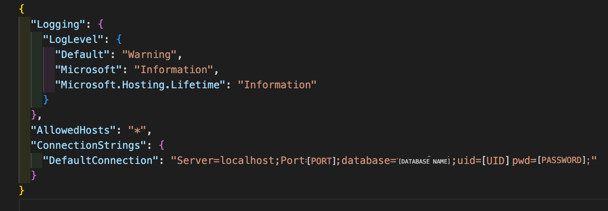

#### By Mauro Rosales jr

#### enables user to make a Travel Api

## Technologies Used

* SQL
* MySQL
* VSCode
* C#
* HTML
* CSS
* Entity Framework
* LazyLoading
* MVC
* Identity
* Postman

## Description

Enables user to make a travel api. There is also some seeded data, so the user doesn't start completely from scratch.

## Setup/Installation Requirements

* clone repo from https://github.com/maurorosalesjr/TravelApi.Solution
* create appsettings.json file to allow user to create a SQL database to this project
* add this code to the appsettings.json file. make sure it looks like :

* add the missing information { "ConnectionStrings": { "DefaultConnection": "Server=localhost;Port=[PORT];database=[DATABASE NAME];uid=[UID];pwd=[PASSWORD];" } }
* make sure appsettings.json file is on the .gitignore file
* in terminal type : dotnet restore
* in terminal type : dotnet build 
*  if no errors, in terminal type : dotnet ef migrations add Initial
* the previous step will build the database
* in terminal type : dotnet ef database update
* in terminal type : dotnet run
* copy/paste : http://localhost:5000 into browser window
* use links to create and build out database like the examples below

## Known Bugs

* no known bugs

## License

open source

for any questions or comments email me here: mauro.rosales247@gmail.com

Copyright (c) August 2022, Mauro Rosales Jr